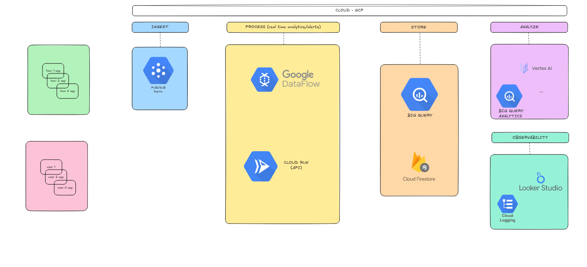
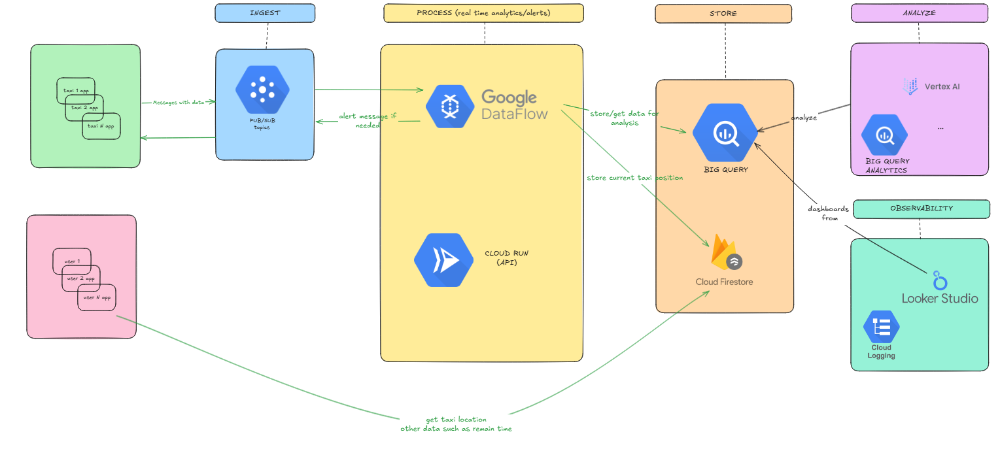
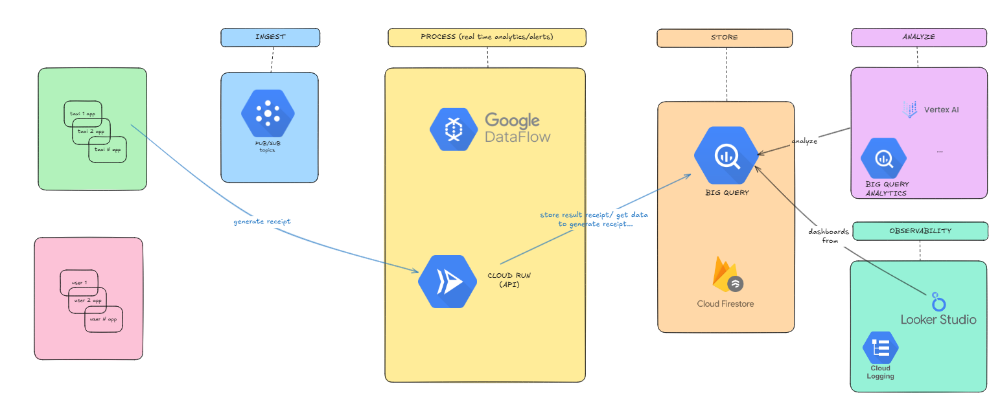
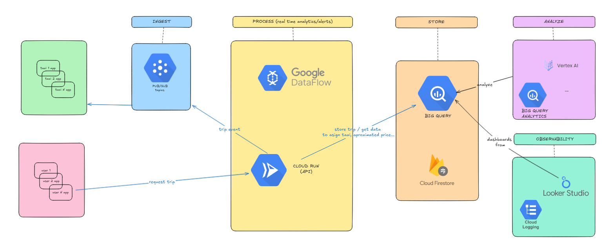

# GCP Data Analytics Architecture Overview




## INGEST

### Pub/Sub

Used to ingest data (eg, vehicle location) asynchronously in real-time with high throughput

But also used to send required events to car drivers such as a requested trip

**COMMUNICATION:**  
All messages are transmitted over encrypted channels using gRPC or HTTPs Communication is secured by:

- IAM-based access control
- Audit logging: Tracks all publishing and subscription events for traceability and security compliance

To be more efficient in performance/operational/cost, it would be groups of topics and subscriptions:

- Topics: Per regions/zones (lower latency) but also could be per country/city to have a specific dataflow assigned with custom analysis

- Subscriptions: Having one per user could be hard to maintain, and with huge cost, but assigning groups of a specific number such as 100 taxi to not overhelm taxi apps, and each app filters by taxi id
---

## PROCESS

### Google Dataflow

Performs real-time stream processing, filtering, transformation, and routing of telemetry data (alerts, analytics ingestion)

**COMMUNICATION:**  
Consumes from Pub/Sub, then writes to :
- BigQuery, stores processed data for long-term analytics, reporting, and operational insights This includes aggregated data on trips, vehicle behavior, and fleet performance
- Firestore, updates taxi position
- Pub/Sub in required scenarios, such as alerts to advice taxi drivers

---

### Cloud Run (APIs)

Exposes RESTful APIs, to request trips, generate receipts ... (transactional requests)

**COMMUNICATION:**  
HTTP(S) requests via public endpoints, authenticates using Google OAuth

Queries BigQuery

Sends information if needed to pub/sub topics.

---

## STORE

### BigQuery
Stores structured, analytical data such as trip history and vehicle movement for querying and ML training

**COMMUNICATION:**  
Read/Write from Dataflow, Cloud Run, Vertex AI 

Queried by Looker Studio, Analytics group

---

###  Firestore

Stores real-time, low-latency state data (current vehicle position)

**COMMUNICATION:**  
Written by Dataflow and CloudRun

Read by user apps

User apps authenticates through Google OAuth, then to assure that only users with asigned taxi can follow taxi updates, use firestore security rules, for example:

To read taxi position, it would be required to read from:

/taxis/{taxi_id}

And then for example we define that the taxi document contains fields such as location, status, assigned_passenger_id, then the rule could be as:

```js
rules_version = '2';
service cloud.firestore {
  match /databases/{database}/documents {
    
    match /vehicles/{taxi_id} {
      allow read: if request.auth != null &&
                  resource.data.assigned_passenger_id == request.auth.uid;
    }
  }
}
````

---

## ANALYZE

### Vertex AI

Used for training and deploying ML models based on BigQuery data (trip prediction, anomaly detection)

**COMMUNICATION:**  
Reads directly from BigQuery

---

### BigQuery Analytics

Used for data analytics, aggregations, trend insights, ML model evaluation

**COMMUNICATION:**  
Direct BigQuery access

---

## OBSERVABILITY

### Looker Studio

Creates dashboards and visualizations based on BigQuery results


**COMMUNICATION:**  
Direct connection to BigQuery, creating groups and views assigned to the required views (technical dashboards, financial dashboards ...)

---

### Cloud Logging

Captures logs from Cloud Run, Dataflow, and other GCP services for monitoring, alerting, and debugging


**COMMUNICATION:**  
Automatically collects logs via Cloud Operations suite

---

##   Data Exfiltration and Infiltration

###  IAM & Permissions

- **Least privilege principle**: Use dedicated service accounts per service, for example:
- **Roles**:
  - Taxis: `roles/pubsub.publisher` on specific Pub/Sub topics (vehicle-location-region-*)
  - Users: N/A
  - Pub/Sub: `roles/pubsubpublisher`, `roles/pubsubsubscriber`
  - Dataflow: `roles/dataflowworker`, `roles/dataflowdeveloper`, `roles/pubsub.subscriber`, `roles/datastore.user` firestore, `roles/bigquery.dataEditor`
  - Cloud Run: `roles/runinvoker`, custom roles for accessing BigQuery
  - BigQuery: `roles/bigquerydataEditor`, `roles/bigquerydataViewer`
  - Vertex AI: `roles/aiplatformuser`

###  Security

- **CMEK**: Enable customer-managed encryption keys for sensitive data in BigQuery, Firestore (rotate them periodically)
- **IAM Conditions**: Limit access by time, IP, or device if needed
- **Authentication**: Cloud Run/Firestore through OAuth, Apps OAuth, and services using SA.
- **Audit Logs**
- **Secure Channels**: TLS (https/grpc)
- **Input validation**: schema validation in dataflow and cloud run


###  Networking

- **No VPC required** under current setup; all services communicate over secure GCP-managed public APIs

###  Observability

- Enable **Cloud Audit Logs** for all services
- Use **Error Reporting** and **Cloud Monitoring** to track pipeline health
- Integrate with **Looker Studio** for real-time business dashboards

### Taxi authentication

Taxis authenticate using Google Oauth, then their users have a custom role assigned, such as taxi-eu-bcn that allows only to topics in eu-bcn to publish and subscribe, (rotate periodically taxi passwords)

---

## Use cases

### Event use case



### Generate receipt use case



### Request trip use case


